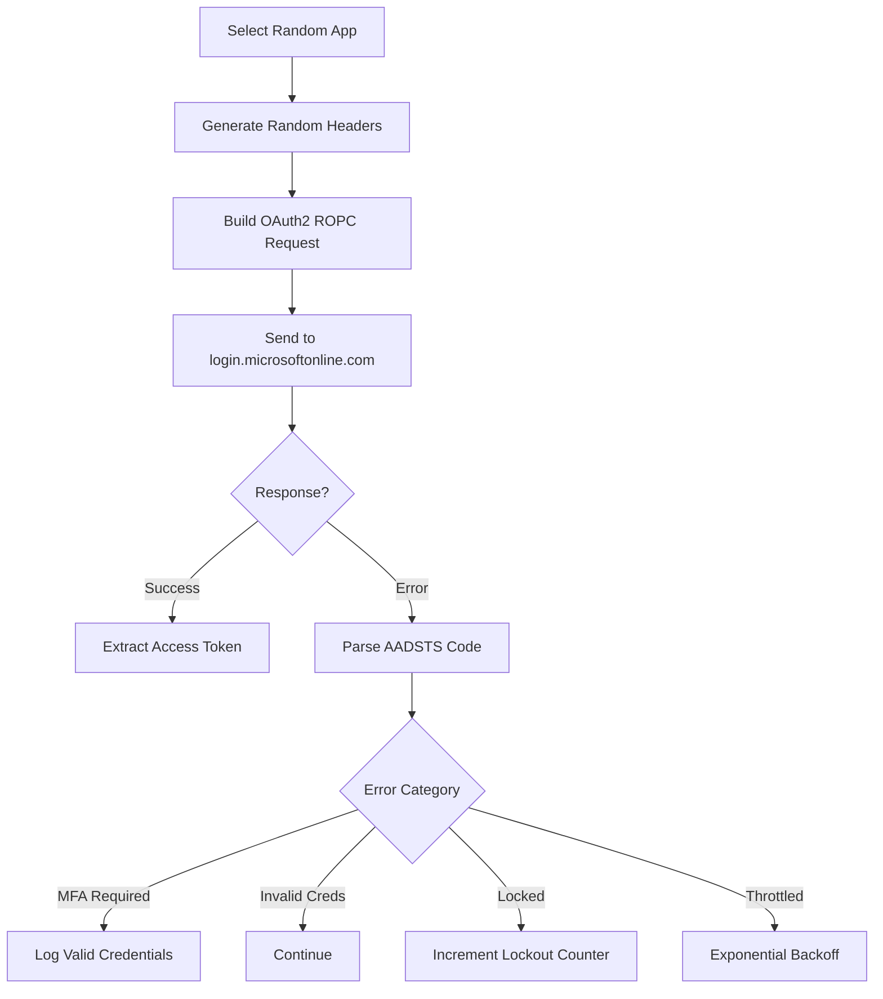

# Invoke-SprayCat 🐾

```
╔══════════════════════════════════════════════════════════════════════════╗
║                                                                          ║
║   ███████╗██████╗ ██████╗  █████╗ ██╗   ██╗     ██████╗ █████╗ ████████╗ ║
║   ██╔════╝██╔══██╗██╔══██╗██╔══██╗╚██╗ ██╔╝    ██╔════╝██╔══██╗╚══██╔══╝ ║
║   ███████╗██████╔╝██████╔╝███████║ ╚████╔╝     ██║     ███████║   ██║    ║
║   ╚════██║██╔═══╝ ██╔══██╗██╔══██║  ╚██╔╝      ██║     ██╔══██║   ██║    ║
║   ███████║██║     ██║  ██║██║  ██║   ██║       ╚██████╗██║  ██║   ██║    ║
║   ╚══════╝╚═╝     ╚═╝  ╚═╝╚═╝  ╚═╝   ╚═╝        ╚═════╝╚═╝  ╚═╝   ╚═╝    ║
║                                                                          ║
║                 🐾  ENTRA ID PASSWORD SPRAY TOOL  🐾                     ║
║                                                                          ║
║            /\_/\          Smart Lockout Evasion                          ║
║           ( o.o )         Horizontal Spray Methodology                   ║
║            > ^ <          MFA Detection & Reporting                      ║
║           /|   |\         AADSTS Error Intelligence                      ║
║          (_|   |_)        CSV Export & Analytics                         ║
║                                                                          ║
║      [+] Stealth Mode    [+] Multi-App Rotation    [+] Smart Delays      ║
║                                                                          ║
╚══════════════════════════════════════════════════════════════════════════╝
```


> **Entra ID Password Spray Tool with Smart Lockout Evasion**

Invoke-SprayCat is a sophisticated password spray tool designed for penetration testing against Microsoft Entra ID (formerly Azure AD) tenants. It implements multiple evasion techniques to minimize detection and avoid account lockouts while identifying valid credentials.


---

## Table of Contents

- [Features](#features)
- [Installation](#installation)
- [Quick Start](#quick-start)
- [Parameters](#parameters)
- [How It Works](#how-it-works)
- [IP Reputation & Batch Mode](#ip-reputation--batch-mode)
- [Evasion Techniques](#evasion-techniques)
- [Output & Results](#output--results)
- [AADSTS Error Intelligence](#aadsts-error-intelligence)
- [Best Practices](#best-practices)
- [Examples](#examples)
- [Legal Disclaimer](#legal-disclaimer)

---

## Features

| Feature | Description |
|---------|-------------|
| **Horizontal Spray** | Tests one password across all users before moving to the next password |
| **Batch Mode** | Sprays N users, then pauses for IP reputation reset (avoids IP-based lockouts) |
| **Smart Delays** | Configurable delays between rounds and users to evade Smart Lockout |
| **IP Reputation Evasion** | Automatic cooldowns after detecting consecutive lockouts |
| **Multi-App Rotation** | Rotates through 24+ legitimate Microsoft application client IDs |
| **Traffic Legitimacy** | Randomized User-Agents, headers, and Accept-Language values |
| **MFA Detection** | Identifies valid credentials even when MFA blocks full authentication |
| **AADSTS Intelligence** | Comprehensive error code parsing with 25+ categorized responses |
| **Progress Indicator** | Real-time progress bar showing current user and percentage complete |
| **CSV Export** | Automatic export of valid credentials with timestamps and tokens |
| **Lockout Protection** | Automatic stop when lockout threshold is reached |

---

## Installation

```powershell
# Clone the SprayCat repository
git clone https://github.com/azurekid/spraycat.git

# Import the function
. ./spraycat/Invoke-SprayCat.ps1
```

### Requirements

- PowerShell 5.1 or later
- Network access to `login.microsoftonline.com`
- No additional modules required

### Supported Input Formats

SprayCat auto-detects user list file formats:

| Format | Description | Example |
|--------|-------------|---------|
| `.txt` | One UPN per line | `user@domain.com` |
| `.csv` | CSV with userPrincipalName, email, or mail column | Entra ID exports |
| `.json` | JSON array or Microsoft Graph response | `{"value": [...]}` |

---

## Quick Start

```powershell
# Basic spray with default batch settings (25 users, 5min cooldown)
Invoke-SprayCat -UserListFile users.txt -PasswordListFile passwords.txt

# Use CSV export directly from Entra ID
Invoke-SprayCat -UserListFile exportUsers.csv -PasswordListFile passwords.txt

# Conservative batch mode (recommended for large user lists)
Invoke-SprayCat -UserListFile users.txt -PasswordListFile passwords.txt -BatchSize 20 -BatchCooldown 600

# Stealth mode with 30-minute delays between password rounds
Invoke-SprayCat -UserListFile users.txt -PasswordListFile passwords.txt -DelayBetweenAttempts 1800

# Fast testing (observation mode - skips inter-round delays, NOT for production)
Invoke-SprayCat -UserListFile users.txt -PasswordListFile passwords.txt -ObservationMode
```

---

## Parameters

| Parameter | Type | Default | Description |
|-----------|------|---------|-------------|
| `UserListFile` | String | *Required* | Path to file containing target usernames (txt/csv/json auto-detected) |
| `PasswordListFile` | String | *Required* | Path to file containing passwords to test (one per line) |
| `MaxFailures` | Int | 100 | Maximum failed attempts before stopping |
| `DelayBetweenAttempts` | Int | 30 | Seconds between password spray rounds (1-3600) |
| `DelayBetweenUsers` | Int | 5 | Seconds between each user attempt (0-1800) |
| `BatchSize` | Int | 25 | Number of users to spray before triggering cooldown (5-100) |
| `BatchCooldown` | Int | 300 | Seconds to wait between batches for IP reputation reset (60-7200) |
| `NoDelay` | Switch | False | Skip all delays (use with caution) |
| `ObservationMode` | Switch | False | Skip inter-round delays for testing |

### Batch Mode Recommendations

| Scenario | BatchSize | BatchCooldown | Risk Level |
|----------|-----------|---------------|------------|
| Testing/Lab | 50 | 60s | 🔴 High |
| Standard Assessment | 25 | 300s (5 min) | 🟡 Medium |
| Production/Stealth | 15-20 | 600s (10 min) | 🟢 Low |

### Delay Recommendations

| Scenario | DelayBetweenAttempts | Risk Level |
|----------|---------------------|------------|
| Testing/Lab | 30 seconds | 🔴 High |
| Quick Assessment | 300 seconds (5 min) | 🟡 Medium |
| Production/Stealth | 1800-3600 seconds (30-60 min) | 🟢 Low |

---

## How It Works

### Horizontal Spray Methodology

Unlike vertical spraying (testing multiple passwords against one user), SprayCat uses horizontal spraying:

```
Round 1: Password1 → User1, User2, User3, ... UserN
Round 2: Password2 → User1, User2, User3, ... UserN
Round 3: Password3 → User1, User2, User3, ... UserN
```

This approach ensures each user only receives one authentication attempt per round, staying well below the Smart Lockout threshold of 10 failed attempts.

### Why Horizontal Spray? (The Math Behind It)

You might wonder: *"Why not distribute different passwords to different users simultaneously? Wouldn't `Password1→User1, Password2→User2, Password3→User3` be more random and harder to detect?"*

**The brutal truth: That approach causes *faster* lockouts, not slower.**

#### Smart Lockout Doesn't Care Which Password You Try

Microsoft's Smart Lockout counts **failed attempts per user**, regardless of which password was attempted:

| Pattern | What User1 sees in 5 minutes | Lockout Risk |
|---------|------------------------------|--------------|
| **Horizontal Spray** | 1 failed attempt (Password1 only) | 🟢 Minimal |
| **Diagonal/Random** | 3-5 failed attempts (Password1, Password3, Password5...) | 🔴 High |

#### Visual Comparison

```
HORIZONTAL (Safe) - Each user gets 1 attempt, then we wait:
┌─────────────────────────────────────────────────────────────┐
│ Round 1: Password1 → User1, User2, User3, User4, User5      │
│          [WAIT 30 MINUTES - lockout counters reset]         │
│ Round 2: Password2 → User1, User2, User3, User4, User5      │
│          [WAIT 30 MINUTES - lockout counters reset]         │
└─────────────────────────────────────────────────────────────┘
User1 failures: 1 per 30 minutes = NEVER locks out

DIAGONAL (Risky) - Multiple passwords hit same user quickly:
┌─────────────────────────────────────────────────────────────┐
│ Batch 1: Pass1→User1, Pass2→User2, Pass3→User3, Pass4→User4│
│ Batch 2: Pass2→User1, Pass3→User2, Pass4→User3, Pass1→User4│
│ Batch 3: Pass3→User1, Pass4→User2, Pass1→User3, Pass2→User4│
└─────────────────────────────────────────────────────────────┘
User1 failures: 3 within minutes = APPROACHING LOCKOUT
```

#### What Diagonal Spray Claims to Solve (But Doesn't)

| Claimed Benefit | Reality |
|-----------------|---------|
| Evades "same password, many users" detection | Microsoft doesn't have this detection mechanism |
| Looks more "random" in logs | Modern SIEMs detect spray behavior regardless of pattern |
| Psychological obfuscation | Security through obscurity ≠ actual security |

#### What Diagonal Spray Actually Breaks

1. **Delay logic becomes complex** - When do you delay? Per-user state tracking required
2. **Crash recovery nightmare** - If script stops, which user/password combos completed?
3. **Higher lockout risk** - One implementation bug = mass account lockouts
4. **No detection benefit** - Entra ID Identity Protection flags anomalous sign-in patterns regardless

#### When Would Diagonal Help?

Only if Microsoft implemented:
- "Same password hash across multiple users" detection (would require storing plaintext - they don't)
- Per-password-pattern analysis (computationally prohibitive at scale)

**Neither exists. Horizontal spray with inter-round delays is mathematically optimal.**

---

## IP Reputation & Batch Mode

### The Hidden Layer: IP-Based Aggregate Detection

Most password spray guides focus on per-account lockout thresholds (10 failed attempts per user). However, Azure Smart Lockout has a **second, less documented layer**:

> *"Microsoft Entra ID also protects against attacks by analyzing signals including **IP traffic** and identifying **anomalous behavior**."*
> — [Microsoft Documentation](https://learn.microsoft.com/en-us/entra/identity/authentication/howto-password-smart-lockout)

#### What This Means

| Detection Layer | Threshold | Scope | What Gets Locked |
|-----------------|-----------|-------|------------------|
| **Per-Account** | 10 failed attempts | Single user | That specific account |
| **IP Reputation** | ~40 failed attempts | All users from IP | ALL accounts from that IP |

#### The Problem

When spraying from a single IP address:
1. Azure tracks **total failed attempts from your IP** across ALL accounts
2. After ~40 attempts, your IP is flagged as an "unfamiliar/hostile location"
3. Azure starts returning `AADSTS50053` for ALL users, regardless of per-account attempts
4. Your spray is effectively blocked

### The Solution: Batch Mode

SprayCat implements **batch-based spraying** with cooldown periods:

```
┌─────────────────────────────────────────────────────────────────────────┐
│  Batch 1: Users 1-25      →  [5 min cooldown - IP reputation resets]   │
│  Batch 2: Users 26-50     →  [5 min cooldown - IP reputation resets]   │
│  Batch 3: Users 51-75     →  [5 min cooldown - IP reputation resets]   │
│  ...                                                                     │
└─────────────────────────────────────────────────────────────────────────┘
```

#### How It Works

1. **BatchSize (default: 25)**: Number of users to test before pausing
2. **BatchCooldown (default: 300s)**: Seconds to wait for IP reputation reset
3. **Early Detection**: 3+ consecutive lockouts trigger emergency cooldown

#### Why 25 Users / 5 Minutes?

- Microsoft's observation window appears to reset after periods of inactivity
- 25 users is safely below the ~40 threshold
- 5 minutes allows sufficient time for reputation scoring to decay
- Conservative settings (20 users / 10 min) are recommended for sensitive targets

### Familiar vs Unfamiliar Locations

Smart Lockout maintains **separate counters** for familiar and unfamiliar locations:

> *"Smart Lockout uses familiar location versus unfamiliar location to differentiate between a bad actor and the genuine user. Both unfamiliar and familiar locations have separate lockout counters."*

Your spray IP is always treated as an **unfamiliar location**, which means:
- Stricter thresholds apply
- Less tolerance for failed attempts
- Faster IP reputation degradation

### Recommended Batch Settings

```powershell
# Standard assessment (50+ users)
Invoke-SprayCat -UserListFile users.txt -PasswordListFile passwords.txt -BatchSize 25 -BatchCooldown 300

# Large user list (200+ users) 
Invoke-SprayCat -UserListFile users.txt -PasswordListFile passwords.txt -BatchSize 20 -BatchCooldown 600

# Maximum stealth (sensitive target)
Invoke-SprayCat -UserListFile users.txt -PasswordListFile passwords.txt -BatchSize 15 -BatchCooldown 900
```

### Authentication Flow



---

## Evasion Techniques

### 1. Multi-Application Rotation

SprayCat rotates through 24 legitimate Microsoft application client IDs:

| Category | Applications |
|----------|--------------|
| **Azure & Management** | Azure PowerShell, Azure CLI, Azure Portal, VS Code, Visual Studio |
| **Microsoft 365** | Office, Teams, OneDrive, Outlook, SharePoint, Word, Excel, PowerPoint |
| **Mobile & Auth** | Authenticator, Company Portal, Intune |
| **Windows** | Windows Login, Windows Store |
| **Power Platform** | Power BI, Power Automate, Power Apps |
| **Dynamics** | Dynamics CRM |

### 2. Randomized User-Agents

19 realistic browser user-agents across multiple platforms:

- **Windows**: Chrome, Edge, Firefox
- **macOS**: Chrome, Safari, Firefox
- **iOS**: Safari (iPhone, iPad)
- **Android**: Chrome (Pixel, Samsung)
- **Linux**: Chrome, Firefox

### 3. Geographic Diversity

Accept-Language headers rotate through 12 locales:
- English (US, GB, AU, CA)
- European (NL, DE, FR, ES, IT, PT-BR)
- Asian (JA)

### 4. Realistic Request Headers

Each request includes randomized:
- `X-Ms-Client-Request-Id` (correlation ID)
- `Sec-Ch-Ua-Platform` (OS platform)
- `X-Client-Os` (client operating system)
- Security headers (`Sec-Fetch-*`)
- MSAL client metadata

---

## Output & Results

### Console Output

```
╔══════════════════════════════════════════════════════════════════════════╗
║                                                                          ║
║   ███████╗██████╗ ██████╗  █████╗ ██╗   ██╗     ██████╗ █████╗ ████████╗ ║
║   ██╔════╝██╔══██╗██╔══██╗██╔══██╗╚██╗ ██╔╝    ██╔════╝██╔══██╗╚══██╔══╝ ║
║   ███████╗██████╔╝██████╔╝███████║ ╚████╔╝     ██║     ███████║   ██║    ║
║   ╚════██║██╔═══╝ ██╔══██╗██╔══██║  ╚██╔╝      ██║     ██╔══██║   ██║    ║
║   ███████║██║     ██║  ██║██║  ██║   ██║       ╚██████╗██║  ██║   ██║    ║
║   ╚══════╝╚═╝     ╚═╝  ╚═╝╚═╝  ╚═╝   ╚═╝        ╚═════╝╚═╝  ╚═╝   ╚═╝    ║
║                                                                          ║
║                 🐾  ENTRA ID PASSWORD SPRAY TOOL  🐾                     ║
║                                                                          ║
║            /\_/\          Smart Lockout Evasion                          ║
║           ( o.o )         Horizontal Spray Methodology                   ║
║            > ^ <          MFA Detection & Reporting                      ║
║           /|   |\         AADSTS Error Intelligence                      ║
║          (_|   |_)        CSV Export & Analytics                         ║
║                                                                          ║
║      [+] Stealth Mode    [+] Multi-App Rotation    [+] Smart Delays      ║
║                                                                          ║
╚══════════════════════════════════════════════════════════════════════════╝

[+] Spray: HORIZONTAL (Batch Mode)
[*] Targets: 50 users × 3 passwords = 150 attempts
[*] Batches: 25 users per batch, 300s cooldown between batches
[*] Delays: 1800s between rounds, 5s between users
[*] IP Evasion: 2 batches × 3 rounds = 6 cooldown periods

[*] ═══ ROUND 1/3 ═══
    [████████████░░░░░░░░] 60% (15/25) Testing: john.doe...
[+] VALID PASSWORD: user@contoso.com : Summer2024! → MFA REQUIRED
    Valid credentials - MFA required | Microsoft Teams
[!] Batch 1 complete. Cooling down 300s (IP reputation reset)...
    [▓▓▓▓▓▓▓▓▓▓░░░░░░░░░░] 180s remaining...
[*] Resuming spray...
[+] FULL ACCESS: admin@contoso.com : Welcome123!
    Full access granted | Azure PowerShell
    Access Token: Acquired

[*] Round 1: Valid=2

╔══════════════════════════════════════════════════════════════════════════╗
║                           SPRAY RESULTS                                   ║
╚══════════════════════════════════════════════════════════════════════════╝

[*] Completed in 45.2 minutes
[+] Valid Credentials: 2
    user@contoso.com : Summer2024!
    admin@contoso.com : Welcome123!
[+] Exported to: ValidCredentials_20260120_143052.csv
[*] Stats: Attempts=150 | InvalidCredentials=148
```

### CSV Export

Valid credentials are automatically exported to CSV with the following columns:

| Column | Description |
|--------|-------------|
| Timestamp | When the credential was validated |
| Username | Normalized username (UPN format) |
| Password | The valid password |
| Application | Microsoft app used for authentication |
| Resource | Target resource (Graph, Management, etc.) |
| ErrorCode | AADSTS code (if MFA/CA blocked) |
| Details | Human-readable status message |
| AccessToken | JWT token (for full access scenarios) |

---

## AADSTS Error Intelligence

SprayCat categorizes 25+ AADSTS error codes into actionable categories:

### Valid Credentials (Password Confirmed)

| Code | Category | Meaning |
|------|----------|---------|
| AADSTS50076 | MFA Required | Password valid, MFA blocking |
| AADSTS50079 | MFA Required | MFA interaction needed |
| AADSTS50074 | MFA Required | Strong authentication required |
| AADSTS50158 | Conditional Access | CA policy requiring MFA/device |
| AADSTS50055 | Password Expired | Valid but expired password |

### Account Issues

| Code | Category | Action |
|------|----------|--------|
| AADSTS50126 | Invalid Credentials | Continue spraying |
| AADSTS50053 | Account Locked | Pause, increment lockout counter |
| AADSTS50057 | Account Disabled | Skip user |
| AADSTS50034 | User Not Found | Skip user |

### Blocking Conditions

| Code | Category | Action |
|------|----------|--------|
| AADSTS53003 | CA Blocked | Log and continue |
| AADSTS530034 | Location Blocked | Log and continue |
| AADSTS50196 | Throttled | Exponential backoff |

---

## Best Practices

### Before You Start

1. **Get Authorization**: Always have written permission before testing
2. **Coordinate with Blue Team**: Inform SOC/security teams of testing windows
3. **Use Lab Accounts First**: Validate tool behavior in non-production environment
4. **Estimate Duration**: Calculate total time including batch cooldowns

### During the Spray

1. **Use Batch Mode**: Always enable for user lists > 25 users
2. **Start with Long Delays**: Use 1800+ seconds between rounds
3. **Conservative Batch Settings**: 20 users / 600s cooldown for sensitive targets
4. **Monitor Lockouts**: Stop immediately if consecutive lockouts detected
5. **Limit Password Count**: 2-3 passwords per session is safer
6. **Schedule Strategically**: Test during business hours to blend with normal traffic

### Timing Calculations

```powershell
# Example: 100 users, 3 passwords, BatchSize=25, BatchCooldown=300s
# Batches per round: 100/25 = 4 batches
# Cooldowns per round: 3 (after batches 1, 2, 3 - not after last)
# Total cooldown time: 3 rounds × 3 cooldowns × 300s = 2700s = 45 minutes
# Plus spray time and inter-round delays
```

### After the Spray

1. **Secure Results**: Encrypt CSV files containing valid credentials
2. **Report Promptly**: Notify client of any valid credentials immediately
3. **Delete Tokens**: Access tokens in CSV should be revoked if tested

---

## Examples

### Example 1: Standard Assessment

```powershell
# Create user list from enumeration
Get-Content enumerated-users.txt | Out-File users.txt

# Create password list (common patterns)
@('Spring2024!', 'Summer2024!', 'Welcome123!') | Out-File passwords.txt

# Run spray with 30-minute delays
Invoke-SprayCat -UserListFile users.txt -PasswordListFile passwords.txt -DelayBetweenAttempts 1800
```

### Example 2: Quick Validation (Lab Only)

```powershell
# Fast mode for testing in lab environments
Invoke-SprayCat -UserListFile users.txt -PasswordListFile passwords.txt -ObservationMode -NoDelay
```

### Example 3: External Guest Accounts

SprayCat automatically handles external guest account formats:

```powershell
# Input file can contain:
# john.doe_contoso.com#EXT#@fabrikam.onmicrosoft.com
# jane.smith@fabrikam.com

# Both formats are normalized and tested correctly
Invoke-SprayCat -UserListFile mixed-users.txt -PasswordListFile passwords.txt
```

### Example 4: Verbose Output

```powershell
# Enable verbose logging for troubleshooting
Invoke-SprayCat -UserListFile users.txt -PasswordListFile passwords.txt -Verbose
```

---

## Return Value

The function returns a hashtable containing detailed statistics:

```powershell
$results = Invoke-SprayCat -UserListFile users.txt -PasswordListFile passwords.txt

# Access results
$results.ValidCredentials      # List of valid credential objects
$results.TotalAttempts         # Total authentication attempts
$results.InvalidCredentials    # Count of invalid password attempts
$results.AccountLocked         # Count of locked accounts encountered
$results.SprayRounds           # Number of password rounds completed
```

---

## Legal Disclaimer

⚠️ **WARNING**: This tool is provided for authorized security testing only.

- **Always** obtain written authorization before testing
- Unauthorized access to computer systems is **illegal**
- The authors assume no liability for misuse of this tool
- You are responsible for compliance with all applicable laws

By using this tool, you agree to use it only for legitimate security testing with proper authorization.

---

## Contributing

Found a bug or have a feature request? Please open an issue on the [SprayCat GitHub repository](https://github.com/azurekid/spraycat).

---

## References

- [Microsoft AADSTS Error Codes](https://learn.microsoft.com/en-us/entra/identity-platform/reference-error-codes)
- [Azure AD Smart Lockout](https://learn.microsoft.com/en-us/entra/identity/authentication/howto-password-smart-lockout)
- [OAuth 2.0 ROPC Flow](https://learn.microsoft.com/en-us/entra/identity-platform/v2-oauth-ropc)

---

*Part of the [SprayCat](https://github.com/azurekid/blackcat) security toolkit.*
